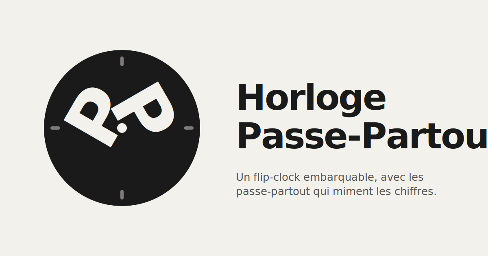

<p align="center">
  
</p>

<p align="center">
  A tiny embeddable flip-clock widget that displays time using
  <em>passe-partout</em> characters miming the digits.
</p>

<p align="center">
  <a href="https://horloge-passe-partout.vercel.app/"><strong>🕰️  Live demo →</strong></a>
</p>

<p align="center">
  <a href="#usage">Usage</a> ·
  <a href="#theming">Theming</a> ·
  <a href="#content-security-policy">CSP</a> ·
  <a href="#development">Development</a> ·
  <a href="#image-credits">Credits</a> ·
  <a href="#license">License</a>
</p>

---

## What is this

A single-file JavaScript snippet (~6 KB minified, zero dependencies) that you
can drop on any web page to render a split-flap clock. Each digit is an image
of a _passe-partout_ character miming that number, animated with a CSS
flip-card transition on every tick.

A small React demo page is included to showcase the widget in a few
configurations (live clock, fixed time, custom format).

<p align="center">
  
</p>

<p align="center">
  <sub>
    Animated preview — the actual passe-partout images cycling through the
    ones-of-seconds panel. Regenerate with <code>make build-preview</code>.
  </sub>
</p>

## Usage

Drop these two lines into any HTML page:

```html
<div data-passe-partout data-format="HH:MM"></div>
<script src="https://horloge-passe-partout.vercel.app/passe-partout.js"></script>
```

Supported attributes on the container:

| Attribute     | Description                                                                                           | Default   |
| ------------- | ----------------------------------------------------------------------------------------------------- | --------- |
| `data-format` | Tokens `HH`, `MM`, `SS`; any other character becomes a literal separator (`:`, `-`, space, etc.).     | `"HH:MM"` |
| `data-time`   | Fixed time like `"07:30"` or `"07:30:45"`. Absent = live clock, re-aligned to the next second/minute. | _(live)_  |

The script scans the DOM on load for every `[data-passe-partout]` node and
mounts a clock inside. You can also mount imperatively:

```js
const instance = window.PassePartout.mount(myElement, {
  format: "HH:MM:SS",
  time: "10:30",
});
instance.destroy(); // tear down when you're done
```

## Theming

The widget exposes CSS custom properties you can override to fit your page:

```css
.pp-clock {
  --pp-size: 120px; /* panel size; default clamp(36px, 11vw, 140px) */
  --pp-gap: 4px; /* gap between panels */
  --pp-bg: #111; /* panel background */
  --pp-sep-color: #111; /* separator character color */
  --pp-flip-duration: 280ms; /* one-half duration of the flip animation */
}
```

`prefers-reduced-motion` is respected: the flip animation is shortened to a
frame when the user prefers reduced motion.

## Content Security Policy

The snippet injects a `<style>` tag on first mount to register the widget's
styles. If your host page ships a strict CSP, that injection is blocked and
the clock renders unstyled. You need either:

```
style-src 'self' 'unsafe-inline';
script-src 'self' https://horloge-passe-partout.vercel.app;
img-src    'self' https://horloge-passe-partout.vercel.app data:;
```

or a nonce-based allowlist. The `data:` source in `img-src` is there because
the preview image (and the animated panels at tick time) reference character
images from the widget's origin — add your deploy URL accordingly.

## Development

```bash
make install   # install npm dependencies
make dev       # Vite dev server on :7733 + esbuild watch on the snippet
make build     # build snippet + React demo into dist/
make test      # run the vitest suite
make check     # typecheck + format-check + tests (CI command)
make format    # format everything with Prettier
```

The snippet is compiled by esbuild from `src/snippet/` into
`public/passe-partout.js`, which Vite serves as-is and includes in the
production `dist/` output. Deploying `dist/` on any static host
(Vercel, Netlify, Cloudflare Pages…) is enough — no API required.

## Project structure

```
src/
  App.tsx             # React demo page that embeds the snippet
  snippet/
    format.ts         # pure parsing / formatting helpers (fully unit-tested)
    panel.ts          # DOM primitives: digit & separator panels
    passe-partout.ts  # entry point: mount / scan / window.PassePartout
    styles.ts         # CSS injected at first mount
public/
  favicon.svg         # site icon
  og.svg              # source for the social preview
  og.png              # rasterized og:image (generated by scripts/build-og.sh)
  preview.svg         # animated README preview (generated by scripts/build-preview.sh)
  passe-partout.js    # the embeddable snippet (generated by esbuild)
  robots.txt          # search engine directives
  sitemap.xml         # site map
  images/             # the passe-partout character images (0-9)
scripts/
  build-preview.sh    # build preview.svg from the digit images
  build-og.sh         # rasterize og.svg into og.png
tests/                # vitest unit + DOM tests
LICENSE               # MIT license (covers the code only; see Credits)
vercel.json           # Vercel build config (framework + outputDirectory)
```

## Image credits

The digit images are photographs of the _passe-partout_ characters from the
French TV game show **Fort Boyard** (© ALP / France Télévisions). They are
reused here in a derivative, non-commercial, personal project as a tribute to
the show. All rights remain with their original holders.

If you are a rights holder and would like the images removed, please open an
issue.

## License

The code in this repository is released under the [MIT License](./LICENSE) ©
YavaDeus. This license covers the source code only — **not** the character
images under `public/images/`, which are subject to the credits above.
